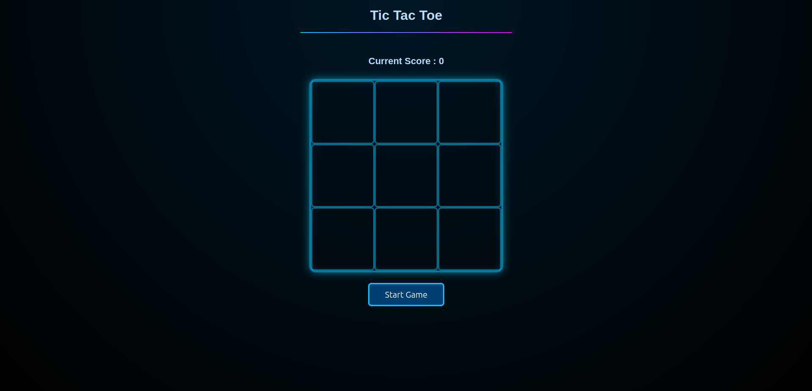

# 🎮 Tic-Tac-Toe with Smart AI

A lightweight, browser-based Tic-Tac-Toe game built using **HTML, CSS, and JavaScript**.


A lightweight, browser-based Tic-Tac-Toe game built using **HTML, CSS, and JavaScript**.
Features a smart computer opponent, random starting turns, player score tracking, and a clean, simple UI.

---

## ⭐ Features

| Feature              | Description                                                              |
| -------------------- | ------------------------------------------------------------------------ |
| 🧠 Smart AI          | Computer plays strategically: **win → block → center → corner → random** |
| 🎲 Random Roles      | Player and computer are randomly assigned **X** or **O** each game       |
| 🔄 Random First Turn | Game randomly decides who plays first                                    |
| 🏆 Score Tracking    | Player score increases every time you win                                |
| ✨ Turn Indicator     | Shows a short **“Your Turn”** message when it becomes your move          |
| 🎨 Winning Highlight | Highlights 3 winning cells when the game ends                            |
| 🔁 Start / Restart   | Start button for the first match, then works as a restart button         |

---

## 📸 Screenshot

<p align="center">
  
</p>


## 📁 Files

```
index.html
style.css
script.js
background.jbackground.jpgpg
```

---

## ▶️ How to Play

1. Click **Start Game**
2. Make a move by clicking any empty tile
3. Computer responds automatically
4. If you win → **score increases**
5. Click **Restart Game** to play again

---

## 🛠 Tech Used

* HTML5
* CSS3
* JavaScript (ES6)

---

## 📄 License

MIT License.
